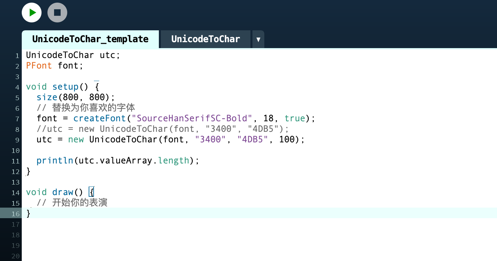
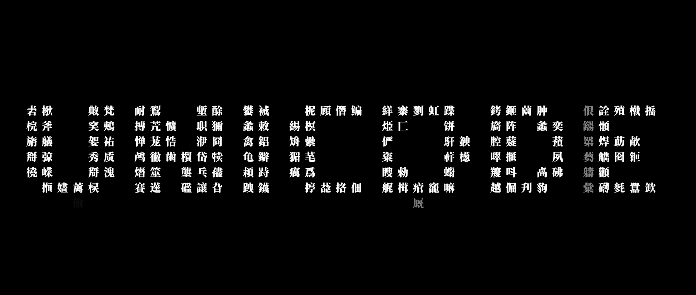
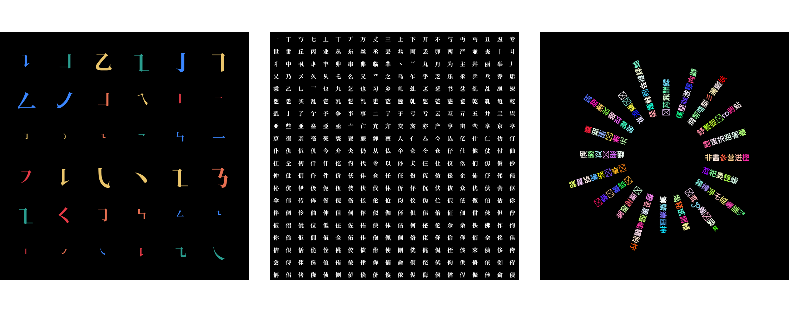
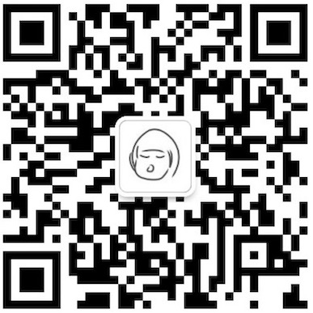

# Unicode 大世界
用于读取 unicode 十六进制字符集编码。通过 UnicodeToChar 类，输出对应字符集数组。
## 设置
使用 UnicodeToChar，首先要实例化一个 UnicodeToChar 对象，最终输出字符集数组 `utc.valueArray`，接下来就可以用 `utc.valueArray` 字符组开始你的工作。
```java
UnicodeToChar utc;
PFont font;

void setup() {
  size(800, 800);
  // 替换为你喜欢的字体
  font = createFont("SourceHanSerifSC-Bold", 18, true);
  utc = new UnicodeToChar(font, "3400", "4DB5", false, 100);
}

void draw() {
    // 你的工作代码
}
```
## 传参
`UnicodeToChar(PFont font, String hexMin, String hexMax, boolean random, int arrayLength)`

`UnicodeToChar(PFont font, String hexMin, String hexMax, boolean random) `

**font:** 指定字体；  
**hexMin:** unicode 字符集编码最小值；  
**hexMan:** unicode 字符集编码最大值；  
**random:** 是否开启随机排列

**arrayLength:** 字符集数组长度。  
arrayLength 为选填参数，当未传入 `arrayLength` 时, `utc.valueArray` 字符组的长度与字符集长度相等（`valueArray.length = hexMax - hexMin`）；

当传入 arrayLength 时， 设置字符组长度，如：`arrayLength = 100`，`utc.valueArray` 字符组的长度则为 100，UnicodeToChar 会在当前字符集中，截取 100 个字符保存到字符组中。

当 arrayLength 大于字符集长度时，arrayLength 长度等于字符集长度。如：`"0041", "005A"`(A - Z 字符集)，共 26 个字符，当 arrayLength 大于 26时，字符组长度依然为 26。


```java
UnicodeToChar utc;
PFont font;

void setup() {
  size(800, 800);
  font = createFont("SourceHanSerifSC-Bold", 18, true);
  utc = new UnicodeToChar(font, "3400", "4DB5", false);

   // utc.valueArray.length = 6581
}
```
```java
UnicodeToChar utc;
PFont font;

void setup() {
  size(800, 800);
  font = createFont("SourceHanSerifSC-Bold", 18, true);
  utc = new UnicodeToChar(font, "3400", "4DB5", false, 100);

  // utc.valueArray.length = 100
}
```
多数情况下建议传入 `arrayLength` 参数，如上方代码中传入的 "3400", "4DB5"（CJK 扩展 B 字符集）。  

未指定 `arrayLength` 时，默认输出字符集长度为 6581，也就是 "3400"、"4DB5" 转换为十进制之后相减的值，这个长度的数组会拖慢运行速度，在不需要用到完整字符集时，建议根据需求，手动设置字符组长度。  

当需要完整字符集时，则不需要传入 `arrayLength` 参数，使其保持默认长度。
## 使用
本打算把它做成一个库文件，可以直接引用的那种，尝试了一下发现短期内我还没没办法实现，所以用了最简单、最粗暴、最幼稚的办法，在这里 [示例](https://github.com/N1U/UnicodeBigBigWorld-forProcessing/tree/master/UnicodeToChar_template) 复制代码到你的编辑器中，然后就开始你的表演吧。  



希望你喜欢 🤗
***  

## 案例

  
在 [examples](https://github.com/N1U/UnicodeBigBigWorld-forProcessing/tree/master/examples) 文件夹中查看基础案例代码。

## 关于 Unicode 
[Unicode 13.0 字符编码表（官方）](http://www.unicode.org/charts/)  
[汉字 Unicode 编码范围](https://www.qqxiuzi.cn/zh/hanzi-unicode-bianma.php)  
[Unicode 编码查询](http://www.52unicode.com/)  
[非常详细的字符编码讲解，ASCII、GB2312、GBK、Unicode、UTF-8等知识点都有(bilibili）](https://www.bilibili.com/video/BV1gZ4y1x7p7)

## 联系我
[@niu_uinniu(新浪微博)](https://weibo.com/u/1683849881?wvr=3.6&lf=reg)
[@n1uu1n(instagram)](https://www.instagram.com/n1uu1n/)
**微信**
